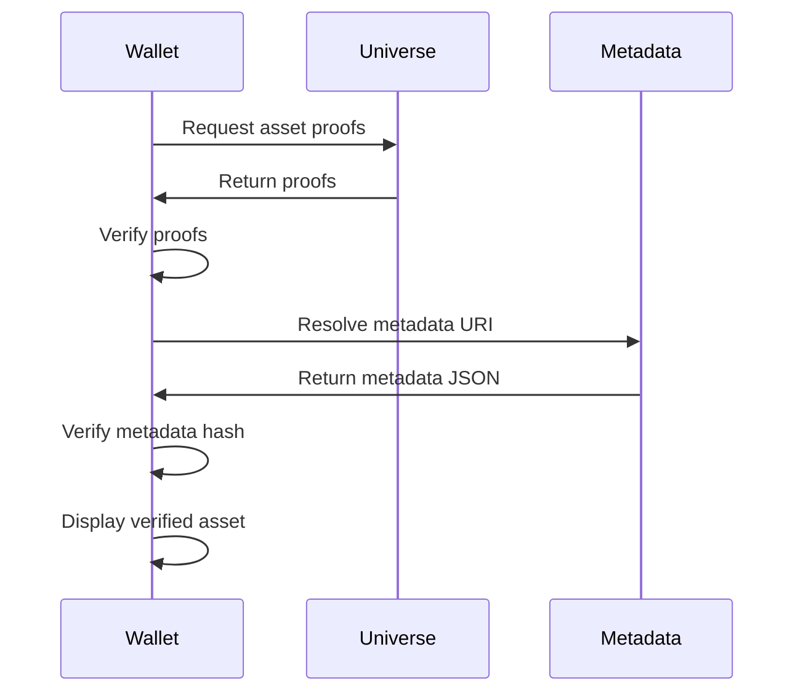

md
# STAS-01 — Reference Diagrams

This document provides visual, non-normative diagrams illustrating the reference architecture and core flows described in the STAS-01 specification and its reference implementation.

These diagrams are intended to help implementers, wallet developers, issuers, and marketplace operators understand how STAS-01 components interact, without introducing any additional normative requirements.

---

## 1. Architecture Overview

This diagram shows the logical components involved in a STAS-01 ecosystem and their relationships.

```mermaid
graph TD
    Issuer[Issuer / Tenant]
    IaaS[Issuer as a Service]
    Wallet[User Wallet]
    Universe[Universe]
    Market[Marketplace Coordinator]

    Issuer -->|mint request| IaaS
    IaaS -->|asset transfer| Wallet
    IaaS -->|publish proofs| Universe
    Wallet -->|proof sync| Universe

    Wallet <-->|RFQ and settlement coordination| Market
````

**Notes:**

* *Issuer as a Service* typically operates Taproot Assets infrastructure (e.g. tapd and Lightning integration).
* Wallets are fully non-custodial.
* The Marketplace Coordinator never custodies assets and never signs transactions.

---

## 2. Tokenization / Mint Flow

This diagram illustrates the process of converting an off-chain collectible into a STAS-01 compliant Taproot Asset and transferring it to a user-controlled wallet.

```mermaid
sequenceDiagram
    participant User
    participant Issuer
    participant IaaS as Issuer Service
    participant Wallet
    participant Universe

    User->>Issuer: Request tokenization
    Issuer->>IaaS: Mint request with metadata
    IaaS->>IaaS: Mint Taproot Asset
    User->>Wallet: Generate asset address
    Wallet->>IaaS: Provide asset address
    IaaS->>Wallet: Transfer Taproot Asset
    IaaS->>Universe: Publish asset proofs
```

---

## 3. Discovery & Verification Flow

This diagram shows how a wallet discovers, verifies, and displays a STAS-01 asset after it has been received.



---

## 4. Marketplace RFQ & Settlement Flow

This diagram illustrates a non-custodial asset trade using an RFQ-based marketplace coordinator.

```mermaid
sequenceDiagram
    participant SellerWallet
    participant Market
    participant BuyerWallet
    participant Universe

    SellerWallet->>Market: Publish listing
    BuyerWallet->>Market: Request RFQ
    Market->>BuyerWallet: Return quote
    BuyerWallet->>BuyerWallet: User approval
    BuyerWallet->>SellerWallet: Execute settlement
    SellerWallet->>Universe: Publish updated proofs
    BuyerWallet->>Universe: Sync new proofs
